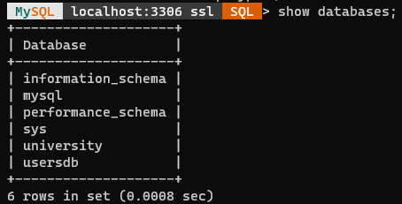
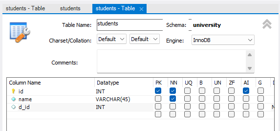
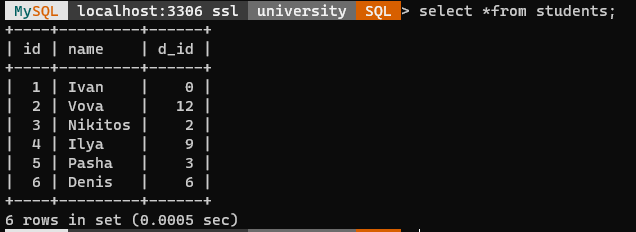
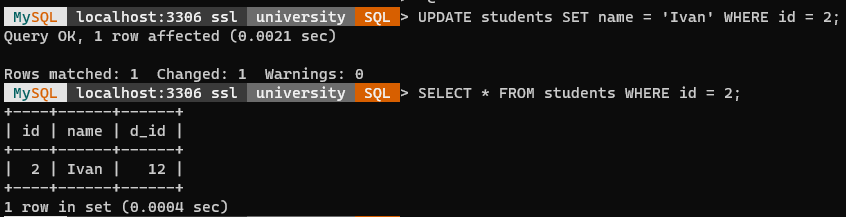
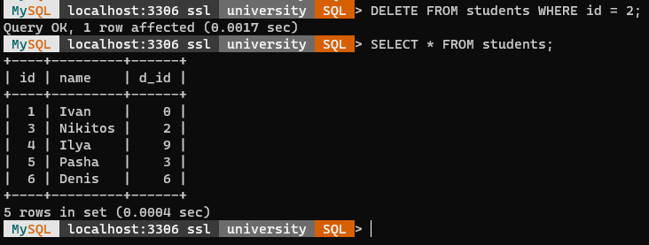

МИНИСТЕРСТВО НАУКИ И ВЫСШЕГО ОБРАЗОВАНИЯ
РОССИЙСКОЙ ФЕДЕРАЦИИ
ФЕДЕРАЛЬНОЕ ГОСУДАРСТВЕННОЕ БЮДЖЕТНОЕ
ОБРАЗОВАТЕЛЬНОЕ УЧРЕЖДЕНИЕ ВЫСШЕГО ОБРАЗОВАНИЯ
«САХАЛИНСКИЙ ГОСУДАРСТВЕННЫЙ УНИВЕРСИТЕТ»

      

Институт естественных наук и техносферной безопасности Кафедра информатики Сунагатов Денис Ринатович

   

Лабораторная работа №10 «Базы данных». 01.03.02 Прикладная математика и информатика

            

Научный руководитель 
Соболев Евгений Игоревич

   

г. Южно-Сахалинск 2022 г.

***

# 
Оглавление

- [Цели и задачи](#задачи)
- [Решение задач](#решение-задач)
  - [MySQL](#mysql)
- [Вывод](#вывод)

***

# 
Задачи

1. Создать базу данных `«university»` в программе-дизайнере `MySQL Workbench`.

2. В базе данных `«university»` создать таблицу `«students»` с полями:

    - `id` тип `int` – ключ (`PK`), счетчик (`AI`);
    - `name` тип `varchar`, ненулевое (`NN`);
    - `d_id` тип `int`.

3. Заполнить таблицу `«students»` произвольными записями (вкладка Inserts) - 5 строк (поле `id` следует заполнять нулями).

4. Сохранить созданную в программе-дизайнере схему базы данных на локальный компьютер.

5. Запустить генерацию базы данных на сервере `MySQL` (Пункт меню: `Database` -> `Forward Engineer`. В опциях необходимо поставить галки против пунктов: `DROP Objects Before Each CREATE Object` и `Generate INSERT
Statements for Tables`).

6. Подключиться к базе данных `MySQL` (команда `mysql –u root –p`).

7. Активизировать базу данных `«university»` (команда `use`).

8. Выполнить SQL команду: `SELECT * FROM students;` результаты записать в отчет.

9. Выполнить SQL команды:
`UPDATE students SET name = ‘Ivan’ WHERE id = 2;`
`SELECT * FROM students WHERE id = 2;` результаты записать в отчет.

10. Выполнить SQL команды:
`DELETE FROM students WHERE id = 2;`
`SELECT * FROM students;` результаты записать в отчет.

11. Проанализировать полученные результаты.

***

# 
Решение задач

## MySQL

Создать базу данных `«university»` в программе-дизайнере `MySQL Workbench`.

В базе данных `«university»` создать таблицу `«students»`.

Активизировать базу данных `«university»` (команда `use`).
Выполнить SQL команду: `SELECT * FROM students;`

Выполнить SQL команды:

- `UPDATE students SET name = ‘Ivan’ WHERE id = 2;`
- `SELECT * FROM students WHERE id = 2;`

Выполнить SQL команды:

- `DELETE FROM students WHERE id = 2;`
- `SELECT * FROM students;`

# 
Вывод

Выполнил *лабораторную работу №10*, вспомнил как работать с СУБД MySQL,
научился работать в программе MySQL Workbench, поработал с MySQL в консоли.
