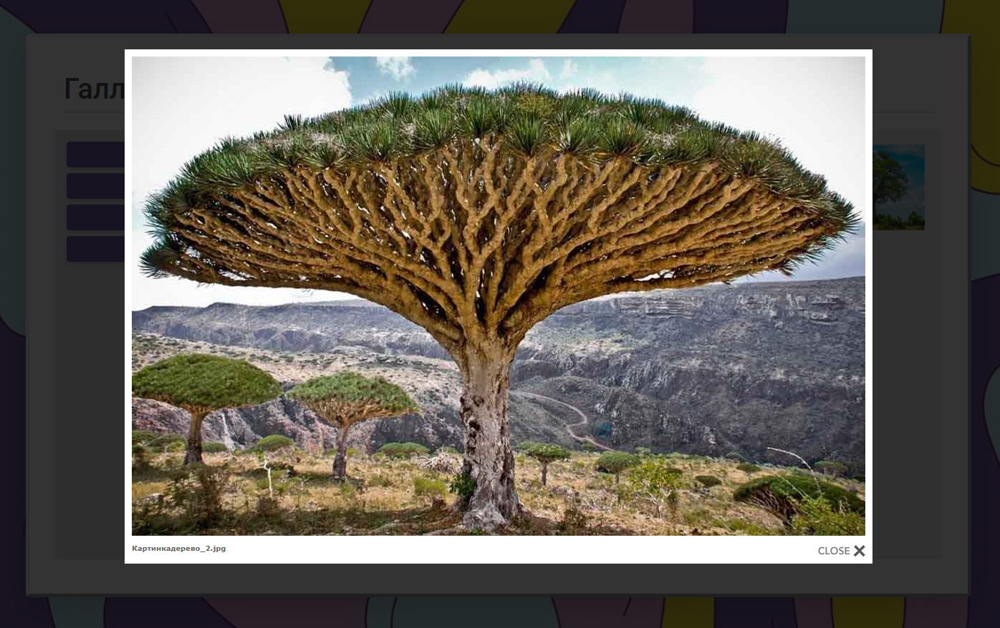

<p align = "center">МИНИСТЕРСТВО НАУКИ И ВЫСШЕГО ОБРАЗОВАНИЯ
РОССИЙСКОЙ ФЕДЕРАЦИИ
ФЕДЕРАЛЬНОЕ ГОСУДАРСТВЕННОЕ БЮДЖЕТНОЕ
ОБРАЗОВАТЕЛЬНОЕ УЧРЕЖДЕНИЕ ВЫСШЕГО ОБРАЗОВАНИЯ
«САХАЛИНСКИЙ ГОСУДАРСТВЕННЫЙ УНИВЕРСИТЕТ»</p>
<br><br><br><br><br><br>
<p align = "center">Институт естественных наук и техносферной безопасности<br>Кафедра информатики<br>Сунагатов Денис Ринатович</p>
<br><br><br>
<p align = "center">Лабораторная работа №12<br>«Node JS».<br>01.03.02 Прикладная математика и информатика</p>
<br><br><br><br><br><br><br><br><br><br><br><br>
<p align = "right">Научный руководитель<br>
Соболев Евгений Игоревич</p>
<br><br><br>
<p align = "center">г. Южно-Сахалинск<br>2022 г.</p>

***

# <p align = "center">Оглавление</p>

- [Цель и задача](#задача)
- [Решение задачи](#решение-задачи)
- [Вывод](#вывод)

***

# <p align = "center">Задача</p>

Реализовать галерею на `Node JS`. Ваше приложение должно делать: 

    -запрос к серверу, получать данные в формате json;
    
    -обработка json и вывод пользователю информацию в виде веб-страницы;
    
    -выводить список альбомов;
    
    -выводить список фотографий;
    
    -переход между альбомом и списком фотографий.

***

# <p align = "center">Решение задачи</p>

1. Для начала я создал `json` файлы для хранения информации, какие есть альбомы - `albums.json`, а так же `gallary.json`, который хранит в себе путь к изображению и к какому альбому оно относится.
### albums.json
```json
[
    {
        "id":0,
        "albumName":"grass",
        "name":"Трава"
    },
    {
        "id":1,
        "albumName":"tree",
        "name":"Деревья"
    },
    {
        "id":2,
        "albumName":"fire",
        "name":"Костер"
    }
]
```

### gallary.json
```json
[
    {
        "id":0, 
        "album":"grass", 
        "src":"трава_1.jpg"
    },
    {
        "id":1, 
        "album":"grass", 
        "src":"трава_2.jpeg"
    },
    {
        "id":2, 
        "album":"grass", 
        "src":"трава_3.jpg"
    },
    {
        "id":3, 
        "album":"tree", 
        "src":"дерево_1.jpg"
    },
    {
        "id":4, 
        "album":"tree", 
        "src":"дерево_2.jpg"
    },
    {
        "id":5, 
        "album":"tree", 
        "src":"дерево_3.jpeg"
    },
    {
        "id":6, 
        "album":"tree", 
        "src":"дерево_4.jpg"
    },
    {
        "id":7, 
        "album":"tree", 
        "src":"дерево_5.jpg"
    },
    {
        "id":8, 
        "album":"tree", 
        "src":"дерево_6.png"
    },
    {
        "id":9, 
        "album":"grass", 
        "src":"трава_4.jpg"
    },
    {
        "id":10, 
        "album":"grass", 
        "src":"трава_5.jpg"
    },
    {
        "id":11, 
        "album":"grass", 
        "src":"трава_6.jpg"
    },
    {
        "id":12, 
        "album":"grass", 
        "src":"трава_7.jpg"
    },
    {
        "id":13, 
        "album":"fire", 
        "src":"костер_1.jpg"
    },
    {
        "id":14, 
        "album":"fire", 
        "src":"костер_2.jpg"
    },
    {
        "id":15, 
        "album":"fire", 
        "src":"костер_3.jpg"
    },
    {
        "id":16, 
        "album":"fire", 
        "src":"костер_4.jpg"
    }
]
```

2. Далее приступил к разработке серверной части. Создал файл `app.js` который будет отвечать за прием и отправку запросов.
### app.js

```js
const express = require("express");
const fs = require("fs");

const app = express();
app.use(express.static('public'));

const albumsPath = "albums.json";
const gallaryPath = "gallary.json";

app.get("/api/albums", function(req, res){
       
    const content = fs.readFileSync(albumsPath, "utf8");
    const albums = JSON.parse(content);
    res.send(albums);
});

app.get("/api/gallary", function(req, res){
       
    const content = fs.readFileSync(gallaryPath, "utf8");
    const gallary = JSON.parse(content);
    res.send(gallary);
});

app.get("/api/albums/:id", function(req, res){
       
    const albumId = req.params.id; 
    const contentAlbums = fs.readFileSync(albumsPath, "utf8");
    const contentGallary = fs.readFileSync(gallaryPath, "utf8");

    const Albums = JSON.parse(contentAlbums);
    const Gallary = JSON.parse(contentGallary);
    let name = "";
    let imgs = [];

    for(var i=0; i<Albums.length; i++){
        if(Albums[i].id==albumId){
            name = Albums[i].albumName;
            break;
        }
    }

    for(var i=0; i<Gallary.length; i++){
        if(Gallary[i].album==name){
            imgs.push(Gallary[i]);
        }
    }

    if(imgs){
        let data = JSON.stringify(imgs);
        res.send(data);
    }
    else{
        res.status(404).send();
    }
});

app.listen(80);
```

3. Для галереи я написал простую `html` страницу на `bootstrap` с библиотекой `lightbox`.
Так же дописал своих стилей и скриптов для нормального функционирования.

<p align = "center">

</p>

### index.html
```html
<!DOCTYPE html>
<html lang="ru">
<head>
    <title>Галерея</title>
    <meta charset="UTF-8">
    <meta http-equiv="X-UA-Compatible" content="IE=edge">
    <meta name="viewport" content="width=device-width, initial-scale=1.0">

    <link href="https://cdnjs.cloudflare.com/ajax/libs/font-awesome/6.0.0/css/all.min.css" rel="stylesheet" />
    <link href="https://cdnjs.cloudflare.com/ajax/libs/mdb-ui-kit/6.0.0/mdb.min.css" rel="stylesheet" />
    <link href="https://fonts.googleapis.com/css?family=Roboto:300,400,500,700&display=swap" rel="stylesheet" />

    <link href="css/lightbox.css" rel="stylesheet" type="text/css" media="screen" />
    <link href="css/index.css" rel="stylesheet" />

    <script type="text/javascript" src="https://cdnjs.cloudflare.com/ajax/libs/mdb-ui-kit/6.0.0/mdb.min.js" defer></script>

    <script type="text/javascript" src="js/prototype.js"></script>
    <script type="text/javascript" src="js/scriptaculous.js?load=effects,builder"></script>
    <script type="text/javascript" src="js/lightbox.js"></script>
</head>
<body class="d-flex justify-content-md-center align-items-center vh-100">  
    <div class="container text-nowrap shadow-lg bg-body rounded-4 p-5 w-75 mh-75" style="min-width:420px; min-height:650px; border-style: outset; border-width: 5px; ">

        <div class="border-bottom border-2 mb-4">
            <h1>Галерея</h1>
        </div>

        <div class="row">
            <div class="mh-600 bc-0 text-nowrap shadow-non rounded-2 p-3 col col-lg-2 h-50 w-25" id="albums">
            </div>

            <div class="mh-600 bc-1 text-nowrap shadow-non rounded-2 p-3 col">
                <div class="row" id="gallary">
                </div>
            </div>
        </div>
    </div>

    <script>
        async function GetAlbums() {
            const response = await fetch("/api/albums", {
                method: "GET",
                headers: { "Accept": "application/json" }
            });
 
            if (response.ok === true) {

                const albums = await response.json();
                let rows = document.getElementById("albums"); 

                rows.innerHTML="";
                rows.innerHTML += "<button type=\"button\" onclick=\"GetGallary()\" class=\"btn btn-color btn-block\">"+
                    "<b>Все картинки</b></button>";

                albums.forEach(album => {
                    rows.innerHTML += "<button type=\"button\" onclick=\"GetAlbum(\'"+album.id+"\')\" class=\"btn btn-color btn-block\">"+
                    "<b>"+album.name+"</b></button>";
                });
            }
        }
        async function GetGallary() {
            const response = await fetch("/api/gallary", {
                method: "GET",
                headers: { "Accept": "application/json" }
            });
 
            if (response.ok === true) {

                const gallary = await response.json();
                let allImgs = document.getElementById("gallary"); 
                
                allImgs.innerHTML = "";
                gallary.forEach(img => {
                    allImgs.innerHTML += "<a class=\"col p-1\" href=\"images/gallary/"+img.src+"\" rel=\"lightbox\" title=\"Картинка"+img.src+"\"></a>";
                });
            }
        }
        async function GetAlbum(id) {
            const response = await fetch("/api/albums/" + id, {
                method: "GET",
                headers: { "Accept": "application/json" }
            });
            if (response.ok === true) {
                const imgs = await response.json();
                let allImgs = document.getElementById("gallary"); 
                
                allImgs.innerHTML = "";
                imgs.forEach(img => {
                    allImgs.innerHTML += "<a class=\"col p-1\" href=\"images/gallary/"+img.src+"\" rel=\"lightbox\" title=\"Картинка"+img.src+"\"></a>";
                });
            }
        }

        GetAlbums();
    </script>
</body>
</html>
```

### index.html
```css
body {
    margin: 0;
    padding: 0;
    background-image: url('/images/background.jpg');
    background-repeat: no-repeat;
    background-attachment: fixed;
    background-size: cover;
}
.btn-color{
    background: #795da8;
    color: #fff;
}
.btn-color:hover{
    background: #ba97f5;
    color: rgb(0, 0, 0);
}
.mh-600{
    min-height:600px;
}
.bc-0{
    background-color: rgba(0, 0, 0, 0.1);
}
.bc-1{
    background-color: rgba(0, 0, 0, 0.05);
}
```

4. Для проверки работы я выбирал все возможные албомы и открывал просмотр изображения.

<p align = "center">
  
  <br>
  
  <br>
  
  <br>
</p>

# <p align = "center">Вывод</p>

Выполнил *лабораторную работу №12*, освоил работу с `Node JS` и отправки / принятия запроса на сервер и создания собственной галлереи на `Node JS`.
